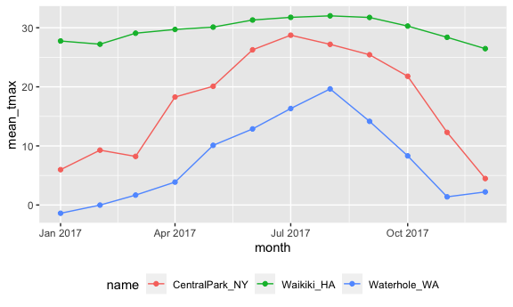
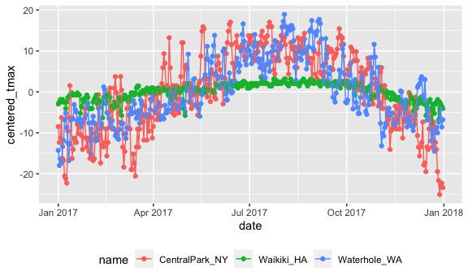

EDA with group_by
================
Jingyi Yao
2022-10-17

``` r
knitr::opts_chunk$set(
  fig.width = 6,
  fig.asp = .6,
  out.width = "90%"
)
```

``` r
library(tidyverse)
```

    ## ── Attaching packages ─────────────────────────────────────── tidyverse 1.3.2 ──
    ## ✔ ggplot2 3.3.6      ✔ purrr   0.3.4 
    ## ✔ tibble  3.1.8      ✔ dplyr   1.0.10
    ## ✔ tidyr   1.2.0      ✔ stringr 1.4.1 
    ## ✔ readr   2.1.2      ✔ forcats 0.5.2 
    ## ── Conflicts ────────────────────────────────────────── tidyverse_conflicts() ──
    ## ✖ dplyr::filter() masks stats::filter()
    ## ✖ dplyr::lag()    masks stats::lag()

``` r
library(ggridges)
```

### `lubridate` package inside `tidverse`

### `floor_date` : round the date to the **first** day in the month it belongs to

``` r
weather_df =  
  rnoaa::meteo_pull_monitors(
    c("USW00094728", "USC00519397", "USS0023B17S"),
    var = c("PRCP", "TMIN", "TMAX"), 
    date_min = "2017-01-01",
    date_max = "2017-12-31") %>%
  mutate(
    name = recode(
      id, 
      USW00094728 = "CentralPark_NY", 
      USC00519397 = "Waikiki_HA",
      USS0023B17S = "Waterhole_WA"),
    tmin = tmin / 10,
    tmax = tmax / 10,
    month = lubridate::floor_date(date, unit = "month")) %>%
  select(name, id, everything())

weather_df
```

    ## # A tibble: 1,095 × 7
    ##    name           id          date        prcp  tmax  tmin month     
    ##    <chr>          <chr>       <date>     <dbl> <dbl> <dbl> <date>    
    ##  1 CentralPark_NY USW00094728 2017-01-01     0   8.9   4.4 2017-01-01
    ##  2 CentralPark_NY USW00094728 2017-01-02    53   5     2.8 2017-01-01
    ##  3 CentralPark_NY USW00094728 2017-01-03   147   6.1   3.9 2017-01-01
    ##  4 CentralPark_NY USW00094728 2017-01-04     0  11.1   1.1 2017-01-01
    ##  5 CentralPark_NY USW00094728 2017-01-05     0   1.1  -2.7 2017-01-01
    ##  6 CentralPark_NY USW00094728 2017-01-06    13   0.6  -3.8 2017-01-01
    ##  7 CentralPark_NY USW00094728 2017-01-07    81  -3.2  -6.6 2017-01-01
    ##  8 CentralPark_NY USW00094728 2017-01-08     0  -3.8  -8.8 2017-01-01
    ##  9 CentralPark_NY USW00094728 2017-01-09     0  -4.9  -9.9 2017-01-01
    ## 10 CentralPark_NY USW00094728 2017-01-10     0   7.8  -6   2017-01-01
    ## # … with 1,085 more rows

## 1. `group_by()`

``` r
weather_df %>%
  group_by(name, month)
```

    ## # A tibble: 1,095 × 7
    ## # Groups:   name, month [36]
    ##    name           id          date        prcp  tmax  tmin month     
    ##    <chr>          <chr>       <date>     <dbl> <dbl> <dbl> <date>    
    ##  1 CentralPark_NY USW00094728 2017-01-01     0   8.9   4.4 2017-01-01
    ##  2 CentralPark_NY USW00094728 2017-01-02    53   5     2.8 2017-01-01
    ##  3 CentralPark_NY USW00094728 2017-01-03   147   6.1   3.9 2017-01-01
    ##  4 CentralPark_NY USW00094728 2017-01-04     0  11.1   1.1 2017-01-01
    ##  5 CentralPark_NY USW00094728 2017-01-05     0   1.1  -2.7 2017-01-01
    ##  6 CentralPark_NY USW00094728 2017-01-06    13   0.6  -3.8 2017-01-01
    ##  7 CentralPark_NY USW00094728 2017-01-07    81  -3.2  -6.6 2017-01-01
    ##  8 CentralPark_NY USW00094728 2017-01-08     0  -3.8  -8.8 2017-01-01
    ##  9 CentralPark_NY USW00094728 2017-01-09     0  -4.9  -9.9 2017-01-01
    ## 10 CentralPark_NY USW00094728 2017-01-10     0   7.8  -6   2017-01-01
    ## # … with 1,085 more rows

## 2. counting things

### `n()`

### `summarize(new column = n())` count in group_by() and summarize()

### store the number of each group in the new column

``` r
weather_df %>%
  group_by(month) %>%
  summarize(n_obs = n())
```

    ## # A tibble: 12 × 2
    ##    month      n_obs
    ##    <date>     <int>
    ##  1 2017-01-01    93
    ##  2 2017-02-01    84
    ##  3 2017-03-01    93
    ##  4 2017-04-01    90
    ##  5 2017-05-01    93
    ##  6 2017-06-01    90
    ##  7 2017-07-01    93
    ##  8 2017-08-01    93
    ##  9 2017-09-01    90
    ## 10 2017-10-01    93
    ## 11 2017-11-01    90
    ## 12 2017-12-01    93

``` r
weather_df %>% 
  group_by(name) %>% 
  summarize(
    n_obs=n()  # n() can calculate the number
  )
```

    ## # A tibble: 3 × 2
    ##   name           n_obs
    ##   <chr>          <int>
    ## 1 CentralPark_NY   365
    ## 2 Waikiki_HA       365
    ## 3 Waterhole_WA     365

### `count(column,name="new column")`

### count the column and store the result in the new column

### do not need to group_by and summarize

``` r
weather_df %>%
  count(month, name = "n_obs")
```

    ## # A tibble: 12 × 2
    ##    month      n_obs
    ##    <date>     <int>
    ##  1 2017-01-01    93
    ##  2 2017-02-01    84
    ##  3 2017-03-01    93
    ##  4 2017-04-01    90
    ##  5 2017-05-01    93
    ##  6 2017-06-01    90
    ##  7 2017-07-01    93
    ##  8 2017-08-01    93
    ##  9 2017-09-01    90
    ## 10 2017-10-01    93
    ## 11 2017-11-01    90
    ## 12 2017-12-01    93

### table is not recommended

``` r
weather_df %>%
  pull(month) %>% 
  table
```

    ## .
    ## 2017-01-01 2017-02-01 2017-03-01 2017-04-01 2017-05-01 2017-06-01 2017-07-01 
    ##         93         84         93         90         93         90         93 
    ## 2017-08-01 2017-09-01 2017-10-01 2017-11-01 2017-12-01 
    ##         93         90         93         90         93

### multiple summaries – count many items in summarize()

### `n_distinct(something)` count the unique items in each group

``` r
weather_df %>%
  group_by(month) %>%
  summarize(
    n_obs = n(),
    n_days = n_distinct(date))
```

    ## # A tibble: 12 × 3
    ##    month      n_obs n_days
    ##    <date>     <int>  <int>
    ##  1 2017-01-01    93     31
    ##  2 2017-02-01    84     28
    ##  3 2017-03-01    93     31
    ##  4 2017-04-01    90     30
    ##  5 2017-05-01    93     31
    ##  6 2017-06-01    90     30
    ##  7 2017-07-01    93     31
    ##  8 2017-08-01    93     31
    ##  9 2017-09-01    90     30
    ## 10 2017-10-01    93     31
    ## 11 2017-11-01    90     30
    ## 12 2017-12-01    93     31

## 3. 2 by 2 table

### use `case_when()` to input (condition – value) results

``` r
weather_df %>% 
  mutate(
    cold = case_when(
      tmax <  5 ~ "cold",
      tmax >= 5 ~ "not_cold",
      TRUE      ~ ""           # last line in case_when to remind you if there is a problem
  )) %>% 
  filter(name != "Waikiki_HA") %>% 
  group_by(name, cold) %>% 
  summarize(count = n())
```

    ## `summarise()` has grouped output by 'name'. You can override using the
    ## `.groups` argument.

    ## # A tibble: 4 × 3
    ## # Groups:   name [2]
    ##   name           cold     count
    ##   <chr>          <chr>    <int>
    ## 1 CentralPark_NY cold        44
    ## 2 CentralPark_NY not_cold   321
    ## 3 Waterhole_WA   cold       172
    ## 4 Waterhole_WA   not_cold   193

### `janitor::tabyl(column1,column2)` to make 2 by 2 table

### use janitor::tabyl() and we do not need group_by() + sumarize()

``` r
weather_df %>% 
  mutate(cold = case_when(
    tmax <  5 ~ "cold",
    tmax >= 5 ~ "not_cold",
    TRUE     ~ ""
  )) %>% 
  filter(name != "Waikiki_HA") %>% 
  janitor::tabyl(name, cold)
```

    ##            name cold not_cold
    ##  CentralPark_NY   44      321
    ##    Waterhole_WA  172      193

## 4. General Summaries

``` r
weather_df %>%
  group_by(month) %>%
  summarize(
    mean_tmax = mean(tmax),
    mean_prec = mean(prcp, na.rm = TRUE),
    median_tmax = median(tmax),
    sd_tmax = sd(tmax))
```

    ## # A tibble: 12 × 5
    ##    month      mean_tmax mean_prec median_tmax sd_tmax
    ##    <date>         <dbl>     <dbl>       <dbl>   <dbl>
    ##  1 2017-01-01      10.8     37.0          6.1   13.1 
    ##  2 2017-02-01      12.2     57.9          8.3   12.1 
    ##  3 2017-03-01      13.0     54.6          8.3   12.4 
    ##  4 2017-04-01      17.3     32.9         18.3   11.2 
    ##  5 2017-05-01      NA       28.4         NA     NA   
    ##  6 2017-06-01      23.5     18.7         27.2    8.73
    ##  7 2017-07-01      NA       12.7         NA     NA   
    ##  8 2017-08-01      26.3     10.2         27.2    5.87
    ##  9 2017-09-01      23.8      9.94        26.1    8.42
    ## 10 2017-10-01      20.1     41.5         22.2    9.75
    ## 11 2017-11-01      14.0     61.5         12.0   11.6 
    ## 12 2017-12-01      11.0     40.2          8.9   11.9

``` r
weather_df %>%
  group_by(name, month) %>%
  summarize(
    mean_tmax = mean(tmax),
    median_tmax = median(tmax))
```

    ## `summarise()` has grouped output by 'name'. You can override using the
    ## `.groups` argument.

    ## # A tibble: 36 × 4
    ## # Groups:   name [3]
    ##    name           month      mean_tmax median_tmax
    ##    <chr>          <date>         <dbl>       <dbl>
    ##  1 CentralPark_NY 2017-01-01      5.98         6.1
    ##  2 CentralPark_NY 2017-02-01      9.28         8.3
    ##  3 CentralPark_NY 2017-03-01      8.22         8.3
    ##  4 CentralPark_NY 2017-04-01     18.3         18.3
    ##  5 CentralPark_NY 2017-05-01     20.1         19.4
    ##  6 CentralPark_NY 2017-06-01     26.3         27.2
    ##  7 CentralPark_NY 2017-07-01     28.7         29.4
    ##  8 CentralPark_NY 2017-08-01     27.2         27.2
    ##  9 CentralPark_NY 2017-09-01     25.4         26.1
    ## 10 CentralPark_NY 2017-10-01     21.8         22.2
    ## # … with 26 more rows

### use `summarize(across(column1:column10, function))` function is in across

### if you want to apply one function to many many columns, use across in summarize()

``` r
weather_df %>%
  group_by(name, month) %>%
  summarize(across(tmin:prcp, mean))
```

    ## `summarise()` has grouped output by 'name'. You can override using the
    ## `.groups` argument.

    ## # A tibble: 36 × 5
    ## # Groups:   name [3]
    ##    name           month        tmin  tmax  prcp
    ##    <chr>          <date>      <dbl> <dbl> <dbl>
    ##  1 CentralPark_NY 2017-01-01  0.748  5.98  39.5
    ##  2 CentralPark_NY 2017-02-01  1.45   9.28  22.5
    ##  3 CentralPark_NY 2017-03-01 -0.177  8.22  43.0
    ##  4 CentralPark_NY 2017-04-01  9.66  18.3   32.5
    ##  5 CentralPark_NY 2017-05-01 12.2   20.1   52.3
    ##  6 CentralPark_NY 2017-06-01 18.2   26.3   40.4
    ##  7 CentralPark_NY 2017-07-01 21.0   28.7   34.3
    ##  8 CentralPark_NY 2017-08-01 19.5   27.2   27.4
    ##  9 CentralPark_NY 2017-09-01 17.4   25.4   17.0
    ## 10 CentralPark_NY 2017-10-01 13.9   21.8   34.3
    ## # … with 26 more rows

## geom_point() + geom_line() or geom_path() : show the lines and the points together

``` r
weather_df %>%
  group_by(name, month) %>%
  summarize(mean_tmax = mean(tmax,na.rm=TRUE)) %>%
  ggplot(aes(x = month, y = mean_tmax, color = name)) + 
    geom_point() + geom_path() + 
    theme(legend.position = "bottom")
```

    ## `summarise()` has grouped output by 'name'. You can override using the
    ## `.groups` argument.



### `knitr::kable(digits = 1)` appended as the last step

### very useful when we print out a tibble or dataframe

### print a table format dataframe with a better look

### what does digits mean ?

``` r
weather_df %>%
  group_by(name, month) %>%
  summarize(mean_tmax = mean(tmax)) %>% 
  pivot_wider(
    names_from = name,
    values_from = mean_tmax) %>% 
  knitr::kable(digits = 2)
```

    ## `summarise()` has grouped output by 'name'. You can override using the
    ## `.groups` argument.

| month      | CentralPark_NY | Waikiki_HA | Waterhole_WA |
|:-----------|---------------:|-----------:|-------------:|
| 2017-01-01 |           5.98 |      27.76 |        -1.40 |
| 2017-02-01 |           9.28 |      27.22 |        -0.02 |
| 2017-03-01 |           8.22 |      29.08 |         1.67 |
| 2017-04-01 |          18.27 |      29.71 |         3.87 |
| 2017-05-01 |          20.09 |         NA |        10.10 |
| 2017-06-01 |          26.26 |      31.31 |        12.87 |
| 2017-07-01 |          28.74 |         NA |        16.33 |
| 2017-08-01 |          27.19 |      32.02 |        19.65 |
| 2017-09-01 |          25.43 |      31.74 |        14.16 |
| 2017-10-01 |          21.79 |      30.29 |         8.31 |
| 2017-11-01 |          12.29 |      28.38 |         1.38 |
| 2017-12-01 |           4.47 |      26.46 |         2.21 |

## 5. Grouped `mutate`

### not using `summarize()` after `group_by`

### use `mutate()` after `group_by`

### summarize() only shows the results of the summarize calculation

### mutate() shows the previous dataframe and the new columns added

``` r
weather_df %>%
  group_by(name) %>%
  mutate(mean_tmax = mean(tmax,na.rm=TRUE),
         centered_tmax =tmax - mean_tmax) %>%
  ggplot(aes(x = date, y = centered_tmax, color = name)) + 
    geom_point() + geom_line() + 
    theme(legend.position = "bottom")
```

    ## Warning: Removed 3 rows containing missing values (geom_point).



## 6. lagged observations

### `lag(data,n = rows)` and `lead(data,n = rows)`

### the parameter `n` specifies how many places(rows) we want to lag or lead

``` r
weather_df %>%
  group_by(name) %>%
  mutate(
    yesterday_tmax=lag(tmax),
    tmax_change = tmax - yesterday_tmax
  ) %>% 
  summarize(
    sd_tmax_change = sd(tmax_change,na.rm=TRUE)
  )
```

    ## # A tibble: 3 × 2
    ##   name           sd_tmax_change
    ##   <chr>                   <dbl>
    ## 1 CentralPark_NY           4.45
    ## 2 Waikiki_HA               1.23
    ## 3 Waterhole_WA             3.13

## 7. Window functions – ranking

### `row_number` rank in ascending order and rank the same number with different orders

### `min_rank` also ranks in ascending order but gives the same number the same order

### `dense_rank` ranks in ascending order and gives the same number the same order but does not rank the next one with a plus 1

``` r
x <- c(5, 1, 3, 2, 2,8,6,6, NA)
row_number(x)
```

    ## [1]  5  1  4  2  3  8  6  7 NA

``` r
min_rank(x)
```

    ## [1]  5  1  4  2  2  8  6  6 NA

``` r
dense_rank(x)
```

    ## [1]  4  1  3  2  2  6  5  5 NA

### `min_rank(column)`

``` r
weather_df %>%
  group_by(name, month) %>%
  mutate(tmax_rank = min_rank(tmax))
```

    ## # A tibble: 1,095 × 8
    ## # Groups:   name, month [36]
    ##    name           id          date        prcp  tmax  tmin month      tmax_rank
    ##    <chr>          <chr>       <date>     <dbl> <dbl> <dbl> <date>         <int>
    ##  1 CentralPark_NY USW00094728 2017-01-01     0   8.9   4.4 2017-01-01        22
    ##  2 CentralPark_NY USW00094728 2017-01-02    53   5     2.8 2017-01-01        12
    ##  3 CentralPark_NY USW00094728 2017-01-03   147   6.1   3.9 2017-01-01        15
    ##  4 CentralPark_NY USW00094728 2017-01-04     0  11.1   1.1 2017-01-01        27
    ##  5 CentralPark_NY USW00094728 2017-01-05     0   1.1  -2.7 2017-01-01         5
    ##  6 CentralPark_NY USW00094728 2017-01-06    13   0.6  -3.8 2017-01-01         4
    ##  7 CentralPark_NY USW00094728 2017-01-07    81  -3.2  -6.6 2017-01-01         3
    ##  8 CentralPark_NY USW00094728 2017-01-08     0  -3.8  -8.8 2017-01-01         2
    ##  9 CentralPark_NY USW00094728 2017-01-09     0  -4.9  -9.9 2017-01-01         1
    ## 10 CentralPark_NY USW00094728 2017-01-10     0   7.8  -6   2017-01-01        21
    ## # … with 1,085 more rows

``` r
weather_df %>%
  group_by(name, month) %>%
  mutate(tmax_rank = min_rank(tmax)) %>% 
  filter(min_rank(tmax) < 4) %>% 
  arrange(name,month,tmax_rank)
```

    ## # A tibble: 128 × 8
    ## # Groups:   name, month [36]
    ##    name           id          date        prcp  tmax  tmin month      tmax_rank
    ##    <chr>          <chr>       <date>     <dbl> <dbl> <dbl> <date>         <int>
    ##  1 CentralPark_NY USW00094728 2017-01-09     0  -4.9  -9.9 2017-01-01         1
    ##  2 CentralPark_NY USW00094728 2017-01-08     0  -3.8  -8.8 2017-01-01         2
    ##  3 CentralPark_NY USW00094728 2017-01-07    81  -3.2  -6.6 2017-01-01         3
    ##  4 CentralPark_NY USW00094728 2017-02-10     0   0    -7.1 2017-02-01         1
    ##  5 CentralPark_NY USW00094728 2017-02-03     0   0.6  -3.2 2017-02-01         2
    ##  6 CentralPark_NY USW00094728 2017-02-04     0   1.1  -5.5 2017-02-01         3
    ##  7 CentralPark_NY USW00094728 2017-03-15     0  -3.2  -6.6 2017-03-01         1
    ##  8 CentralPark_NY USW00094728 2017-03-11     0  -1.6  -8.2 2017-03-01         2
    ##  9 CentralPark_NY USW00094728 2017-03-12     0  -1.6  -7.1 2017-03-01         2
    ## 10 CentralPark_NY USW00094728 2017-04-01     0   8.9   2.8 2017-04-01         1
    ## # … with 118 more rows

``` r
weather_df %>%
  group_by(name, month) %>%
  filter(min_rank(desc(tmax)) < 4)
```

    ## # A tibble: 149 × 7
    ## # Groups:   name, month [36]
    ##    name           id          date        prcp  tmax  tmin month     
    ##    <chr>          <chr>       <date>     <dbl> <dbl> <dbl> <date>    
    ##  1 CentralPark_NY USW00094728 2017-01-12    13  18.9   8.3 2017-01-01
    ##  2 CentralPark_NY USW00094728 2017-01-13     0  16.7   0   2017-01-01
    ##  3 CentralPark_NY USW00094728 2017-01-26     5  13.3   6.1 2017-01-01
    ##  4 CentralPark_NY USW00094728 2017-02-19     0  18.3  11.7 2017-02-01
    ##  5 CentralPark_NY USW00094728 2017-02-23     0  18.3   6.7 2017-02-01
    ##  6 CentralPark_NY USW00094728 2017-02-24     0  21.1  14.4 2017-02-01
    ##  7 CentralPark_NY USW00094728 2017-03-01    30  21.1  12.2 2017-03-01
    ##  8 CentralPark_NY USW00094728 2017-03-02     0  17.8   1.7 2017-03-01
    ##  9 CentralPark_NY USW00094728 2017-03-25     3  16.7   5.6 2017-03-01
    ## 10 CentralPark_NY USW00094728 2017-04-16     0  30.6  15   2017-04-01
    ## # … with 139 more rows

### the difference between the original data and the lagged data

``` r
weather_df %>%
  group_by(name) %>%
  mutate(temp_change = tmax - lag(tmax))
```

    ## # A tibble: 1,095 × 8
    ## # Groups:   name [3]
    ##    name           id          date        prcp  tmax  tmin month      temp_cha…¹
    ##    <chr>          <chr>       <date>     <dbl> <dbl> <dbl> <date>          <dbl>
    ##  1 CentralPark_NY USW00094728 2017-01-01     0   8.9   4.4 2017-01-01     NA    
    ##  2 CentralPark_NY USW00094728 2017-01-02    53   5     2.8 2017-01-01     -3.9  
    ##  3 CentralPark_NY USW00094728 2017-01-03   147   6.1   3.9 2017-01-01      1.1  
    ##  4 CentralPark_NY USW00094728 2017-01-04     0  11.1   1.1 2017-01-01      5    
    ##  5 CentralPark_NY USW00094728 2017-01-05     0   1.1  -2.7 2017-01-01    -10    
    ##  6 CentralPark_NY USW00094728 2017-01-06    13   0.6  -3.8 2017-01-01     -0.5  
    ##  7 CentralPark_NY USW00094728 2017-01-07    81  -3.2  -6.6 2017-01-01     -3.8  
    ##  8 CentralPark_NY USW00094728 2017-01-08     0  -3.8  -8.8 2017-01-01     -0.600
    ##  9 CentralPark_NY USW00094728 2017-01-09     0  -4.9  -9.9 2017-01-01     -1.10 
    ## 10 CentralPark_NY USW00094728 2017-01-10     0   7.8  -6   2017-01-01     12.7  
    ## # … with 1,085 more rows, and abbreviated variable name ¹​temp_change

``` r
weather_df %>%
  group_by(name) %>%
  mutate(temp_change = tmax - lag(tmax)) %>%
  summarize(
    temp_change_sd = sd(temp_change, na.rm = TRUE),
    temp_change_max = max(temp_change, na.rm = TRUE))
```

    ## # A tibble: 3 × 3
    ##   name           temp_change_sd temp_change_max
    ##   <chr>                   <dbl>           <dbl>
    ## 1 CentralPark_NY           4.45            12.7
    ## 2 Waikiki_HA               1.23             6.7
    ## 3 Waterhole_WA             3.13             8
