ggplot2 part I
================
Jingyi Yao
2022-10-17

### global settings of the layout format

``` r
knitr::opts_chunk$set(
  fig.width = 6,
  fig.asp = .6,
  out.width = "90%"
)
```

## load `tidyverse` and `ggridges`

``` r
library(tidyverse)
```

    ## ── Attaching packages ─────────────────────────────────────── tidyverse 1.3.2 ──
    ## ✔ ggplot2 3.3.6      ✔ purrr   0.3.4 
    ## ✔ tibble  3.1.8      ✔ dplyr   1.0.10
    ## ✔ tidyr   1.2.0      ✔ stringr 1.4.1 
    ## ✔ readr   2.1.2      ✔ forcats 0.5.2 
    ## ── Conflicts ────────────────────────────────────────── tidyverse_conflicts() ──
    ## ✖ dplyr::filter() masks stats::filter()
    ## ✖ dplyr::lag()    masks stats::lag()

``` r
library(ggridges)
```

#### working with `NOAA weather` data

#### downloaded using `rnoaa::meteo_pull_monitors` function

``` r
weather_df = 
  rnoaa::meteo_pull_monitors(
    c("USW00094728", "USC00519397", "USS0023B17S"),
    var = c("PRCP", "TMIN", "TMAX"), 
    date_min = "2017-01-01",
    date_max = "2017-12-31") %>%
  mutate(
    name = recode(
      id, 
      USW00094728 = "CentralPark_NY", 
      USC00519397 = "Waikiki_HA",
      USS0023B17S = "Waterhole_WA"),
    tmin = tmin / 10,
    tmax = tmax / 10) %>%
  select(name, id, everything())
```

    ## Registered S3 method overwritten by 'hoardr':
    ##   method           from
    ##   print.cache_info httr

    ## using cached file: ~/Library/Caches/R/noaa_ghcnd/USW00094728.dly

    ## date created (size, mb): 2022-09-06 10:41:07 (8.397)

    ## file min/max dates: 1869-01-01 / 2022-09-30

    ## using cached file: ~/Library/Caches/R/noaa_ghcnd/USC00519397.dly

    ## date created (size, mb): 2022-09-06 10:41:10 (1.697)

    ## file min/max dates: 1965-01-01 / 2020-02-29

    ## using cached file: ~/Library/Caches/R/noaa_ghcnd/USS0023B17S.dly

    ## date created (size, mb): 2022-09-06 10:41:12 (0.949)

    ## file min/max dates: 1999-09-01 / 2022-09-30

## Basic scatterplot

``` r
ggplot(weather_df, aes(x = tmin, y = tmax)) + 
  geom_point()
```

    ## Warning: Removed 15 rows containing missing values (geom_point).


### `drop_na()` to eliminate the rows with `NA`

``` r
weather_df %>% drop_na() %>% ggplot(aes(x = tmin, y = tmax)) + geom_point()
```


``` r
# drop_na
```

``` r
weather_scatterplot=
  weather_df %>% 
  drop_na() %>% 
  ggplot(aes(x = tmin, y = tmax)) + geom_point() 

# already claimed the weather_df at the front, do not claim it in ggplot()
```

## plotting more fancy

### color the points in `geom_point(aes(color=column))`

### add a smooth line in `geom_smooth()`

``` r
ggplot(weather_df, aes(x = tmin, y = tmax)) + 
  geom_point(aes(color = name)) +  # aes in geom_point()
  geom_smooth()                    # does it looks like a linear association?
```

    ## `geom_smooth()` using method = 'gam' and formula 'y ~ s(x, bs = "cs")'

    ## Warning: Removed 15 rows containing non-finite values (stat_smooth).

    ## Warning: Removed 15 rows containing missing values (geom_point).

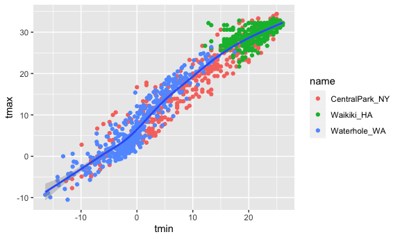

### the `ggplot(aes())` applies to the whole plot

### the `geom_point(aes())` only to the points

``` r
ggplot(weather_df, aes(x = tmin, y = tmax,color = name)) + # aes color in ggplot too
  geom_point(aes(color = name)) +  # aes in geom_point()
  geom_smooth()                    
```

    ## `geom_smooth()` using method = 'loess' and formula 'y ~ x'

    ## Warning: Removed 15 rows containing non-finite values (stat_smooth).

    ## Warning: Removed 15 rows containing missing values (geom_point).


### set the alpha of points in `geom_point(aes(alpha=0.3))` the degree of transparency

### set the smooth vurve with `se=FALSE` whether shows the CI around the curve

``` r
ggplot(weather_df, aes(x = tmin, y = tmax,color=name)) + 
  geom_point(aes(color = name,alpha=.3)) +
  geom_smooth(se=FALSE)                    
```

    ## `geom_smooth()` using method = 'loess' and formula 'y ~ x'

    ## Warning: Removed 15 rows containing non-finite values (stat_smooth).

    ## Warning: Removed 15 rows containing missing values (geom_point).

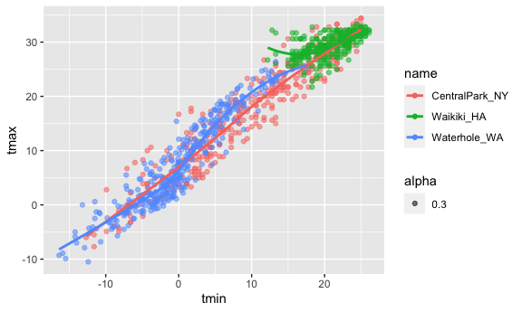

### delete the points only shows the smooth lines by deleting `geom_point()`

``` r
ggplot(weather_df, aes(x = tmin, y = tmax,color=name)) + 
  geom_smooth()                    
```

    ## `geom_smooth()` using method = 'loess' and formula 'y ~ x'

    ## Warning: Removed 15 rows containing non-finite values (stat_smooth).

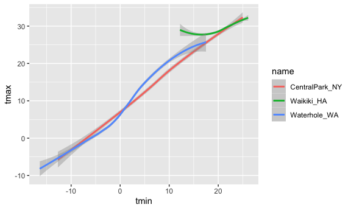

### facet using `face_grid(y column ~ x column)` line the plots in columns

``` r
ggplot(weather_df, aes(x = tmin, y = tmax,color=name)) + 
  geom_point(aes(color = name,alpha=.3)) +
  geom_smooth(se=FALSE) +
  facet_grid(.~name)
```

    ## `geom_smooth()` using method = 'loess' and formula 'y ~ x'

    ## Warning: Removed 15 rows containing non-finite values (stat_smooth).

    ## Warning: Removed 15 rows containing missing values (geom_point).

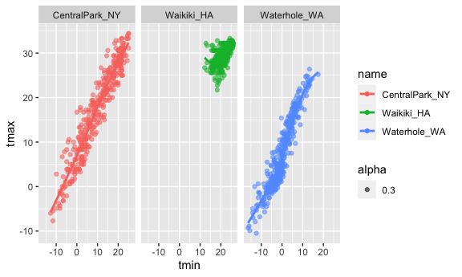

### change the facet direction line the plots in rows

``` r
ggplot(weather_df, aes(x = tmin, y = tmax,color=name)) + 
  geom_point(aes(color = name,alpha=.3)) +
  geom_smooth(se=FALSE) +
  facet_grid(name ~ .)
```

    ## `geom_smooth()` using method = 'loess' and formula 'y ~ x'

    ## Warning: Removed 15 rows containing non-finite values (stat_smooth).

    ## Warning: Removed 15 rows containing missing values (geom_point).

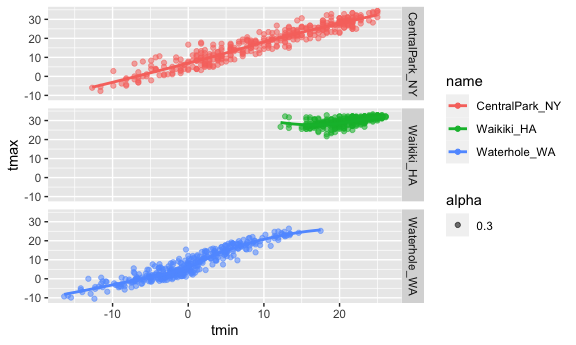

### change the size of points in `geom_points(aes(size=column))`

### the size depends on the value of data in the specified column

``` r
weather_df %>% 
  ggplot(aes(x=date,y=tmax,color=name))+
  geom_point(alpha=.3,aes(size = prcp))+
  geom_smooth(se= FALSE)+
  facet_grid(.~name)
```

    ## `geom_smooth()` using method = 'loess' and formula 'y ~ x'

    ## Warning: Removed 3 rows containing non-finite values (stat_smooth).

    ## Warning: Removed 3 rows containing missing values (geom_point).


### only shows the fitted lines

``` r
ggplot(weather_df, aes(x = date, y = tmax, color = name)) + 
  geom_smooth(se = FALSE) 
```

    ## `geom_smooth()` using method = 'loess' and formula 'y ~ x'

    ## Warning: Removed 3 rows containing non-finite values (stat_smooth).

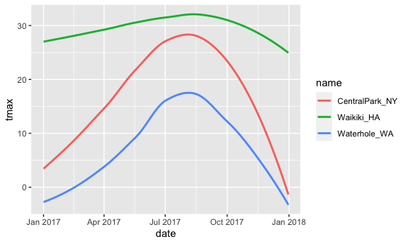

### `geom_hex()`show the points in **hexagons shapes**

``` r
ggplot(weather_df, aes(x = tmax, y = tmin)) + 
  geom_hex()
```

    ## Warning: Removed 15 rows containing non-finite values (stat_binhex).

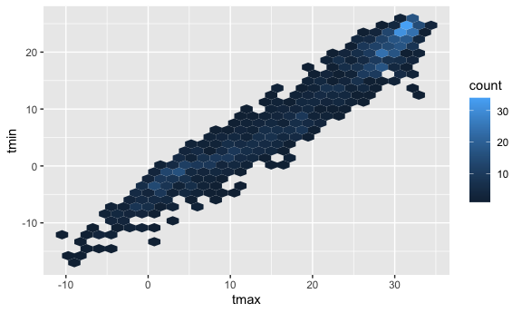

## Univariate Plots – histograms, barplots,violins

## histograms

### `geom_histogram` to make a histogram

``` r
ggplot(weather_df, aes(x = tmax)) + 
  geom_histogram()
```

    ## `stat_bin()` using `bins = 30`. Pick better value with `binwidth`.

    ## Warning: Removed 3 rows containing non-finite values (stat_bin).

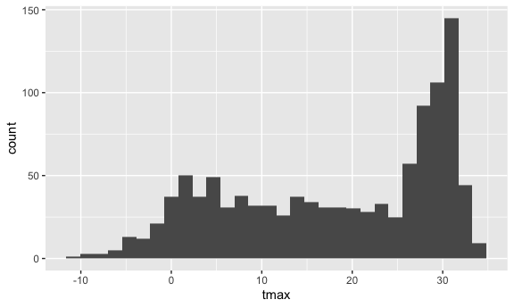

### `ggplot(aes(fill=column))` setting the filling color for the histogram

``` r
ggplot(weather_df, aes(x = tmax,fill=name)) + 
  geom_histogram()
```

    ## `stat_bin()` using `bins = 30`. Pick better value with `binwidth`.

    ## Warning: Removed 3 rows containing non-finite values (stat_bin).

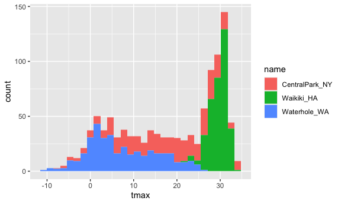

### `geom_histogram(position = "dodge")` put the bars together

### `geom_histogram(binwidth= 1)` set the bin width

``` r
ggplot(weather_df, aes(x = tmax, fill = name)) + 
  geom_histogram(position = "dodge", binwidth = 2)
```

    ## Warning: Removed 3 rows containing non-finite values (stat_bin).

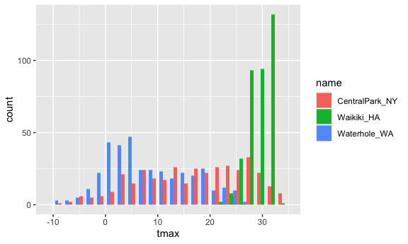

## Density plots

### `geom_density(alpha,adjust,color)` to make density plot

### `alpha` is the degree of transparency of the filling

### `color` is the color of the fillin area

``` r
ggplot(weather_df, aes(x = tmax, fill = name)) + 
  geom_density(alpha = .4, adjust = .5, color = "blue")
```

    ## Warning: Removed 3 rows containing non-finite values (stat_density).

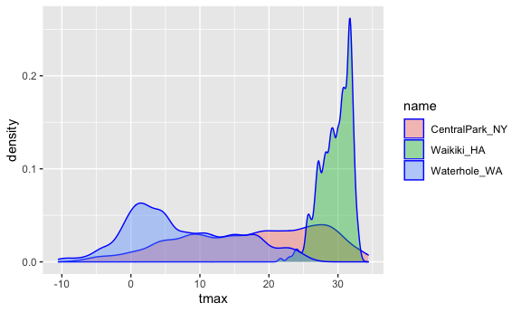

## Boxplots

``` r
ggplot(weather_df, aes(x = name, y = tmax,fill=name)) + geom_boxplot()
```

    ## Warning: Removed 3 rows containing non-finite values (stat_boxplot).

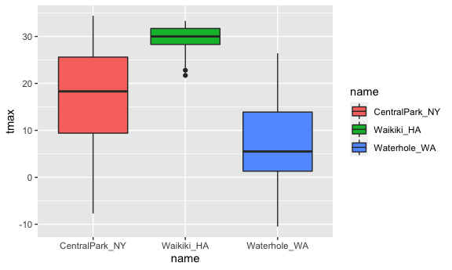

## Violin Plots

### `+ stat_summary(fun= ,color= )` add summary stat to the violin plot

### `fun = "median"` shows the median point in the violin plot

### `color =  "blue"` is the color or the median point, the color is in the quotation mark

``` r
ggplot(weather_df, aes(x = name, y = tmax)) + 
  geom_violin(aes(fill = name), alpha = .5) + 
  stat_summary(fun = "median", color = "blue")
```

    ## Warning: Removed 3 rows containing non-finite values (stat_ydensity).

    ## Warning: Removed 3 rows containing non-finite values (stat_summary).

    ## Warning: Removed 3 rows containing missing values (geom_segment).

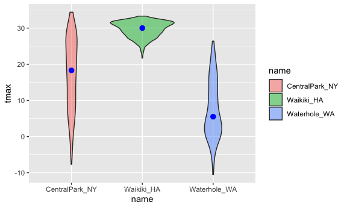

## Ridge Plots

### ridge plot is the stacked density plot without overlapping

### `geom_density_ridgdes` remember the s in ridges

``` r
ggplot(weather_df, aes(x = tmax, y = name)) + 
  geom_density_ridges(scale = .85)
```

    ## Picking joint bandwidth of 1.84

    ## Warning: Removed 3 rows containing non-finite values (stat_density_ridges).

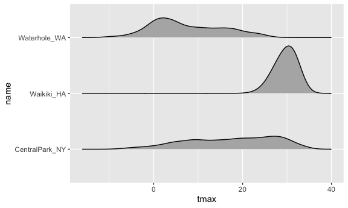

## Saving and Embedding plots

### first, let’s make a plot

``` r
weather_scatterplot =
  weather_df %>% 
  ggplot(aes(x=date,y=tmax,color=name))+
  geom_point(aes(size=prcp),alpha=.3)+
  geom_smooth(se=FALSE)+
  facet_grid(.~name)

weather_scatterplot
```

    ## `geom_smooth()` using method = 'loess' and formula 'y ~ x'

    ## Warning: Removed 3 rows containing non-finite values (stat_smooth).

    ## Warning: Removed 3 rows containing missing values (geom_point).

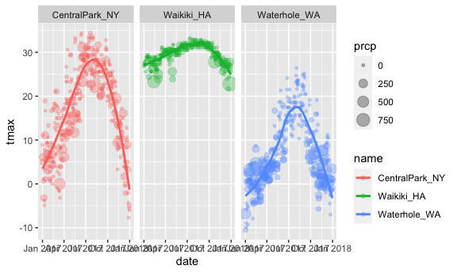

### next, save the scatterplot

### set the file name, and size in `ggsave()`

### `plot = previous plot name`

### `width = , height =`

``` r
ggsave(file="weather_scatter_plot.pdf",plot=weather_scatterplot,width=8,height=5)
```

    ## `geom_smooth()` using method = 'loess' and formula 'y ~ x'

    ## Warning: Removed 3 rows containing non-finite values (stat_smooth).

    ## Warning: Removed 3 rows containing missing values (geom_point).
